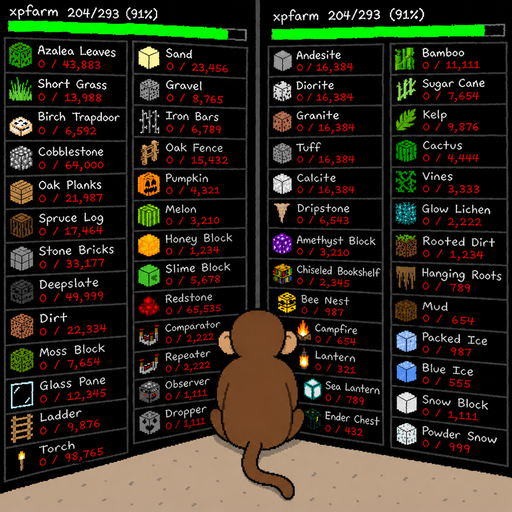
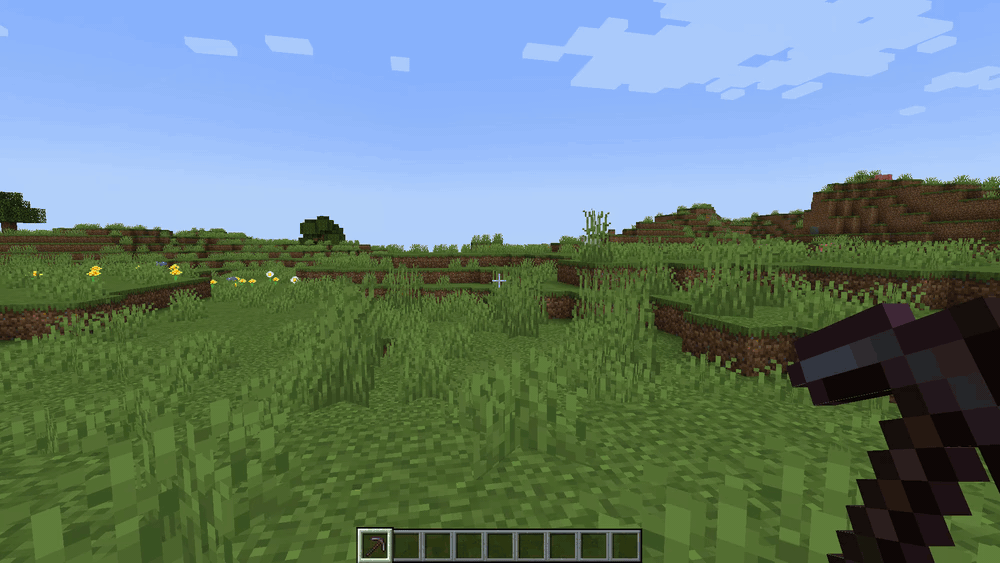
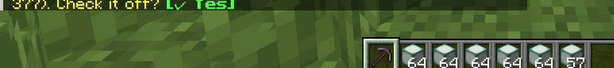
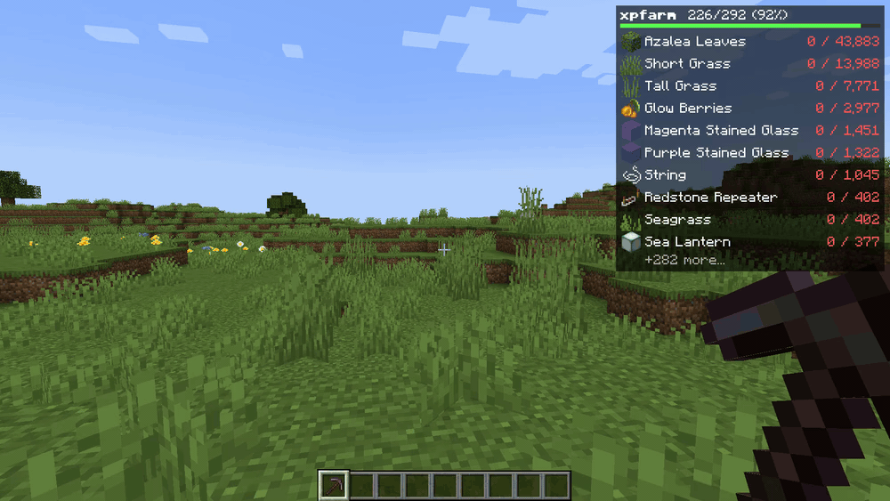
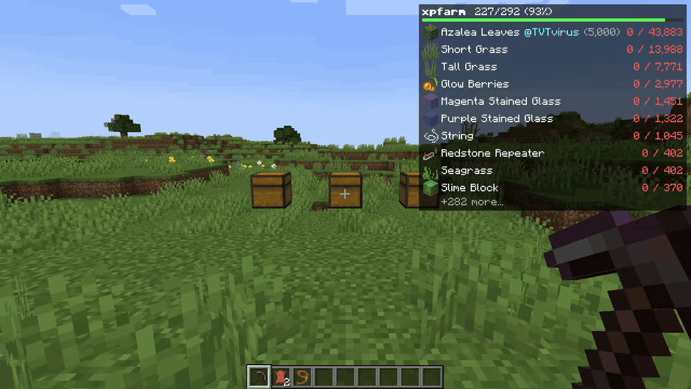
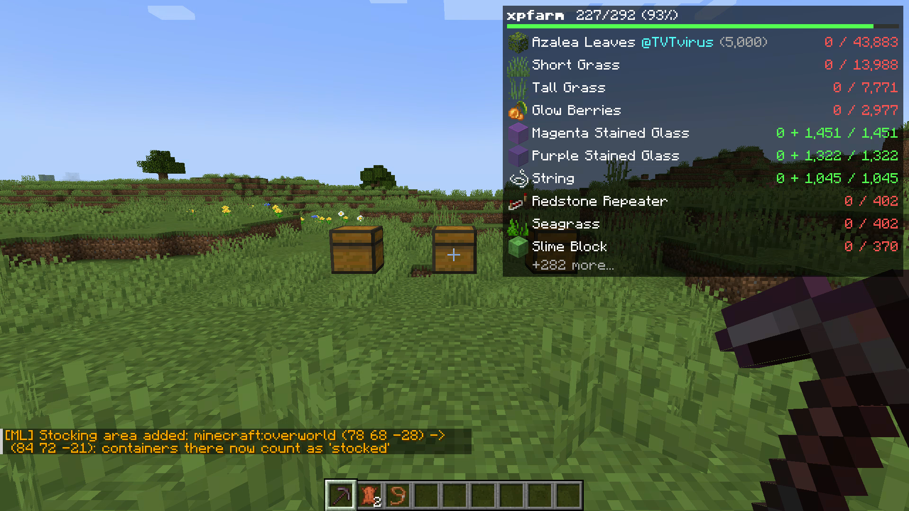
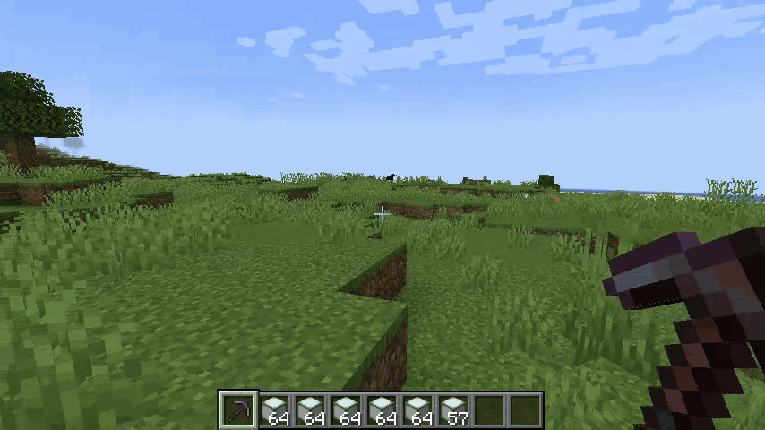
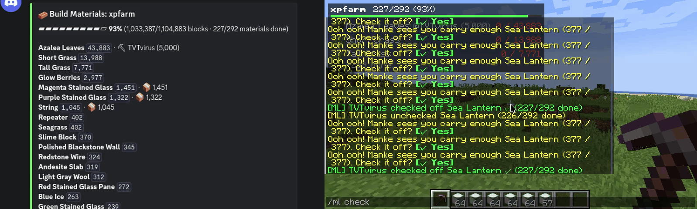

<div align="center">

# MankeList



**A shared material list for community builds: live HUD, chat checklists, claims, stock tracking and a self-updating Discord board. One jar.**

[](https://www.minecraft.net/)
[](https://fabricmc.net/)
[](https://modrinth.com/mod/fabric-api)
[](#installation)
[](LICENSE)

English | [Español](README_es.md)

</div>

---

## What is it?

Your community is building something big. Everyone needs to know **what
materials are missing, who is farming what, and how far along you are**,
without pinging an admin or opening a spreadsheet.

**MankeList** keeps ONE shared material list on the server that everybody
works against:

- 📥 **Import straight from a `.litematic`**: `/ml import` parses the
  schematic on the server and builds the list (no external tools).
- ✅ **Collaborative checks**: anyone can `/ml check` a finished material;
  the whole server sees the announcement.
- 🐵 **Manke's nudge (opt-in)**: players who `/ml follow` get a private
  *"Ooh ooh! Manke sees you carry enough Hopper (48 / 18). Check it off?
  [✓ Yes]"* when their inventory covers a pending material. Works for players
  **without the mod** too (it's plain clickable chat).
- ⛏ **Claims**: `/ml claim obsidian` tells everyone you are on it. When it
  gets checked off, the name sticks as *who got it*.
- 📦 **Stocking areas**: mark the drop-off chest room with
  `/ml stockarea add` and the server counts what is already stored (nested
  shulkers included). Progress becomes *fine-grained*: 190k obsidian in
  chests counts, even before anyone checks the item off.
- 🖥️ **Optional client HUD**: a Litematica-style overlay with live
  *carrying + stocked / needed* counts against your own inventory, custom
  ordering, and multi-list cycling. Players without the client mod lose
  nothing but the overlay.
- 📊 **Discord board built in**: paste a webhook URL in the config and the
  mod posts the full list to a channel and **keeps editing the same
  messages**: a live board with progress bars, 📦 stock and ⛏ claims. No bot,
  no extra process.

<div align="center">

</div>

## Installation

**Server** (required): drop `mankelist-x.y.z.jar` + [Fabric API](https://modrinth.com/mod/fabric-api)
into the server's `mods/` folder. That's it: everything below works with a
vanilla client.

**Client** (optional, for the HUD): install the same jar client-side. The
server streams the list to modded clients only (Servux-style custom payloads);
vanilla clients are never sent anything.

## Quick start

```
/ml import my_build.litematic     ← builds + activates the list from the schematic
/ml follow                        ← opt into Manke's inventory nudges
/ml stockarea add 100 60 100 120 70 120   ← the chest room where materials get dropped
```



Then farm away: check things off by clicking Manke's **[✓ Yes]**, or manually
with `/ml check <material>`.

## Commands

Everyone:

| Command | What it does |
| --- | --- |
| `/ml` or `/ml status` | List(s) with progress, stock and claims |
| `/ml check <material>` | Check a material off (announced server-wide) |
| `/ml uncheck <material>` | Oops button |
| `/ml claim <material>` | Tell everyone you are farming it |
| `/ml have <amount> <material>` | Report partial progress ("I have 5,000 of the azaleas so far"): claims it for you and counts toward the progress bars |
| `/ml unclaim <material>` | Release your claim (OPs can release anyone's) |
| `/ml follow` / `/ml unfollow` | Opt in/out of Manke's inventory nudges |
| `/ml stock` | Compact report of what is already in the stocking areas |
| `/ml lists` | Active lists, saved lists and available list files |

OPs (permission level 2):

| Command | What it does |
| --- | --- |
| `/ml import <file.litematic>` | Parse a schematic into a list and activate it |
| `/ml load <list>` | (Re)read a list file and activate it (**resets checks**) |
| `/ml switch <list>` | Re-activate a saved list **keeping its progress** |
| `/ml unload <list>` | Deactivate (progress kept for later `/ml switch`) |
| `/ml reset [list]` | Uncheck everything |
| `/ml stockarea add <x1 y1 z1> <x2 y2 z2>` | Add a stocking area (your current dimension) |
| `/ml stockarea list` / `clear` | Inspect / remove stocking areas |

Materials match by short id (`emerald_block`), full id or display name, with
real tab-completion. Several lists can be active at once; when a material
exists in more than one, disambiguate as `list/material` (e.g.
`/ml check xpfarm/hopper`): the autocomplete and Manke's buttons do this for
you.

<div align="center">


</div>

## The HUD (client mod)



| Key | Action |
| --- | --- |
| `J` | Toggle the HUD |
| `Shift+J` | Open the config screen (also via Mod Menu or a rebindable key) |
| `K` | Cycle the focused list (when several are active) |

All keys are rebindable in **Options → Controls → Key Binds** under the
*MankeList* category, in case `J`/`K` clash with your other mods.

<div align="center">

</div>

Pending rows show **carrying + stocked / needed** against your own inventory
(shulker and bundle contents included) with red/yellow/green coloring; checked
rows collapse to a ✓ and claims render as `@Name`. Sort by amount or arrange a
fully custom order (grab & drop, searchable). Corner, scale, icons, background
and line count are all configurable in-game.

## Discord board

1. In your Discord channel: **Edit channel → Integrations → Webhooks → New
   webhook**, copy its URL.
2. Put it in `config/mankelist-server.json` → `"discordWebhookUrl"`.
3. Restart. The mod posts the board and from then on **edits it in place**
   whenever the list changes (at most once every 10 s).

<div align="center">

</div>

## Server config (`config/mankelist-server.json`)

| Field | Default | Meaning |
| --- | --- | --- |
| `statePath` | `config/mankelist/state.json` | Where the shared state lives (auto-created). If a legacy schemlist/MCDR layout (`../config/schemlist/state.json`) already exists, it is reused |
| `importDir` | `schematics` | Folder scanned for `.litematic` files by `/ml import` (auto-created; `syncmatics` is used if that folder already exists) |
| `discordWebhookUrl` | `""` | Discord webhook for the built-in board (empty = off) |
| `pollSeconds` | `5` | How often the state file's mtime is checked |
| `promptsEnabled` | `true` | Master switch for Manke's nudges |
| `scanSeconds` | `30` | Inventory scan interval for the nudges |
| `promptCooldownSeconds` | `600` | Per player+material nudge cooldown |
| `stockScanSeconds` | `60` | Stocking-area container scan interval |

## List file format

Lists are plain JSON next to the state file: trivially scriptable:

```json
{
  "name": "xpfarm",
  "source": "xpfarm.litematic",
  "blocks": [
    { "id": "minecraft:obsidian", "display": "Obsidian", "count": 189746, "done": false }
  ]
}
```

The state file adds `claim` (who) and `stocked` (how many delivered) per
entry, and an `active` array. External tools can read or write these files;
the server picks changes up within `pollSeconds`.

## Compatibility

- Minecraft **1.21**, Fabric Loader ≥ 0.16, Fabric API. JDK 21 to build
  (`./gradlew build`, jar lands in `build/libs/`).
- Old clients keep working against newer servers (versioned network channels).
- The state format is compatible with the schemlist MCDR plugin, if you come
  from that ecosystem.

## License

[MIT](LICENSE). HUD layout inspired by Litematica's material list; written
from scratch, no code copied.
